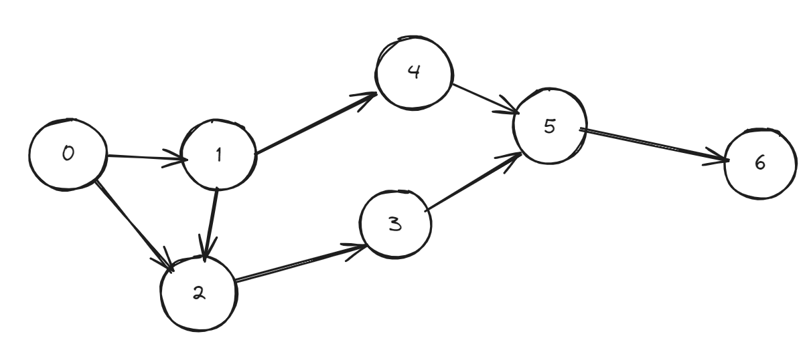
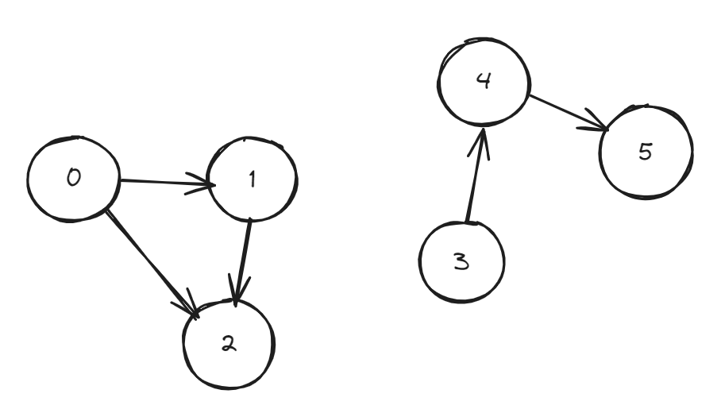

# Breadth–first search (BFS)

BFS is an algorithm for traversing or searching tree or graph data structures. It starts at the tree root (or some arbitrary node of a graph, sometimes referred to as a ‘search key’) and explores the neighbor nodes first before moving to the next-level neighbors.

The following graph shows the order in which the nodes are discovered in BFS:

Breadth–first search (BFS) is a graph traversal algorithm that explores vertices in the order of their distance from the source vertex, where distance is the minimum length of a path from the source vertex to the node as evident from the above example.

**Applications of BFS**

- Copying garbage collection, Cheney’s algorithm.
- Finding the shortest path between two nodes u and v, with path length measured by the total number of edges (an advantage over depth–first search).
- Testing a graph for bipartiteness.
- Minimum Spanning Tree for an unweighted graph.
- Web crawler.
- Finding nodes in any connected component of a graph.
- Ford–Fulkerson method for computing the maximum flow in a flow network.
- Serialization/Deserialization of a binary tree vs. serialization in sorted order allows the tree to be reconstructed efficiently.

Reference: [Breadth-First Search (BFS) - Techie Delight](https://www.techiedelight.com/breadth-first-search/)

# Test Cases

**Case 1:**

 

**Case 2:**

